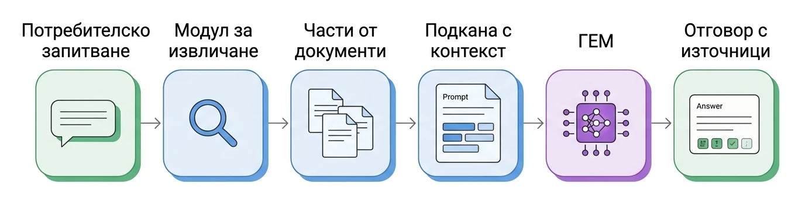
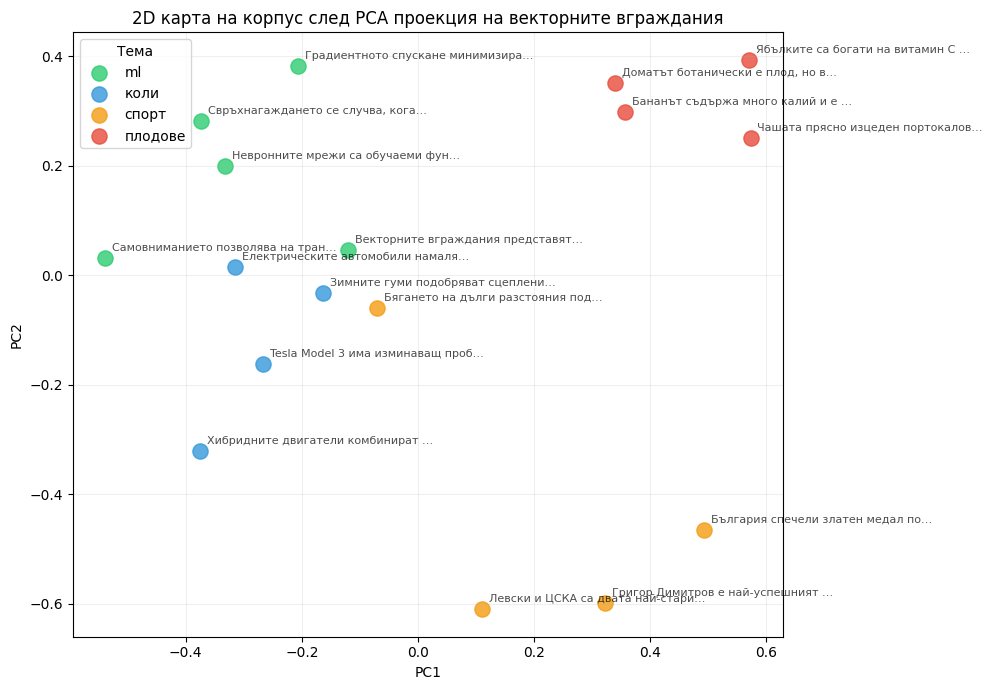
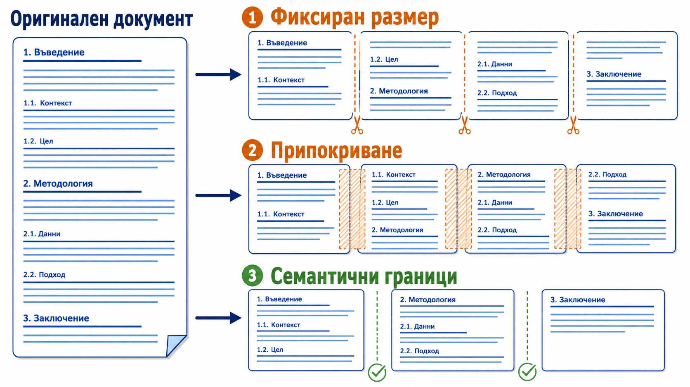
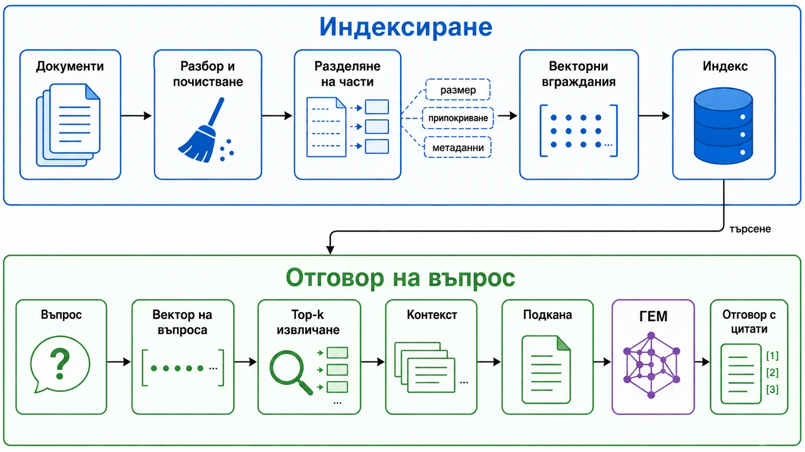

<!-- _class: lead -->

# Халюцинации и RAG

## Лекция 12

---

## Кратък преговор — Лекция 11

- Видяхме как се пускат малки ГЕМ локално чрез **Ollama**.
- **Квантизацията** намалява изискванията към паметта и прави локалното пускане възможно на по-скромен хардуер.
- Локалните модели са полезни за **поверителност, контрол на разходите, офлайн употреба и експерименти**.
- Но по-малките модели по-често дават уверени грешни отговори.

<div class="highlight">
Днес: как правим тези отговори по-надеждни, когато моделът трябва да стъпва върху външни, проверими източници?
</div>

---

## Въпрос за дискусия

# Кога ГЕМ генерират невярна информация?

---

## План

1. Кога и защо ГЕМ халюцинират?
2. Идеята на RAG
3. Векторни вграждания и семантично търсене
4. Разделяне на документи и подготовка на индекс
5. Векторни бази данни и стратегии за извличане
6. RAG система от край до край
7. Оценяване и debugging

---

<!-- _class: lead -->

# Какво са халюцинациите и защо възникват?

---

## Дефиниция

**Халюцинация** е отговор, който е убедителен като текст, но не е подкрепен от:

- реалните факти;
- предоставения контекст;
- наличните източници;
- извършените действия на системата.

<div class="highlight">
Проблемът не е само дали отговорът е верен, а дали е проверим.
</div>

---

## Примерни грешки

| Вид | Как изглежда | Примерна грешка |
|-----|--------------|-----------------|
| Фактическа грешка | грешна дата, автор, число | „Python е създаден през 2001 г.“ |
| Неподкрепено твърдение | може да е вярно, но не следва от контекста | „Клиентът може да прекрати без неустойка“, когато договорът не казва това |
| Измислен източник | реалистично изглеждаща, но несъществуваща референция | „Smith et al., Nature 2022“ като източник за несъществуваща статия |
| Противоречие в контекста | добавен детайл, който противоречи на документа | Контекстът казва „15 май“, моделът отговаря „30 май“ |
| Инструкционна халюцинация | моделът твърди, че е извършил действие | „Проверих сайта и качих файла“, без да има такъв инструмент |

---

## Типични рискови ситуации

- Много нова информация
- Рядка или вътрешна информация
- Въпрос с грешна предпоставка
- Искане за точни цитати, DOI, URL, съдебни дела
- Точни числа, дати, имена, правни или медицински факти
- Противоречиви източници в обучаващите данни
- Подкана, която насърчава уверен отговор вместо „не знам“

---

## Защо възникват?

- Обучителната задача е **предвиждане на следващ токен**, не проверка на факти.
- Знанието е компресирано в параметрите, а параметрите не са база данни.
- Вероятността на токени не е същото като увереност във факт.
- Данните имат времева граница.
- Настройването към инструкции често насърчава полезен отговор вместо отказ.
- Семплирането добавя вариативност.

---

<!-- _class: lead -->

# ↓ Тетрадка

## Халюцинации

---

## Защо това е системен проблем?

В реални приложения потребителят често не може лесно да различи:

- верен отговор;
- звучащ правдоподобно отговор;
- измислен източник;
- отговор, който е верен, но не е подкрепен от дадените документи.

Затова ни трябва архитектура за **заземяване в източници**, не само по-добър стил на отговор.

---

<!-- _class: lead -->

# Разширено генериране с извличане

## Retrieval-Augmented Generation (RAG)

---

## Какво не може да реши само подканата?

Подканите помагат за:

- формат;
- тон;
- последователност;
- критерии за отказ;
- начин на мислене през задачата;
- ограничено количество допълнителни факти.

Но подканата не може да добави голямо количество нови знания, на които моделът не е бил трениран.

---

## Основна идея

RAG добавя стъпка за търсене преди генерирането:

1. Потребителят задава въпрос.
2. Системата извлича релевантни части от документи.
3. Частите се добавят в контекста.
4. ГЕМ генерира отговор върху този контекст.

---

## RAG процес



---

## Защо работи?

При генериране моделът предвижда следващия токен условно на целия вход:

- инструкциите;
- въпроса;
- извлечените документни части;
- формата на очаквания отговор.

Ако контекстът съдържа „крайният срок е 15 май“, този факт вече е част от входа за текущата заявка.

---

## Какво променя RAG?

RAG премества факта от:

> ненадеждна параметрична памет

към:

> явен контекст при текущата заявка

Това прави верния отговор по-вероятен и проверим.

**Но не го гарантира.**

---

## Важно ограничение

RAG не премахва халюцинациите напълно.

Системата пак може да се провали, ако:

- извлече грешен документ;
- пропусне правилния документ;
- добави прекалено много шум;
- моделът игнорира контекста;
- цитатите не сочат към реален източник.

---

<!-- _class: lead -->

# Векторни вграждания и семантично търсене

---

## От текст към вектор

**Векторно вграждане (embedding)** е числов вектор, който представя смисъла на текст.

Идеята:

- близки по смисъл текстове → близки вектори;
- различни теми → по-далечни вектори;
- търсенето става геометричен проблем.

---

## Семантично търсене

Семантичното търсене намира текстове, които са близки по смисъл, дори когато думите са различни.

Пример:

> „Жилище в южните райони на София“

може да намери документ за:

> „апартамент 160 кв.м. в квартал Лозенец“

---

## Косинусова близост

Косинусовата близост измерва ъгъла между два вектора.

Интуиция:

- една и съща посока → близък смисъл;
- различна посока → различен смисъл;
- мащабът на вектора е по-малко важен от посоката.

$$
\cos(\theta) = \frac{A \cdot B}{\|A\|\|B\|}
$$

---

## Избор на модел за векторни вграждания

Важни въпроси:

- Какви езици поддържа?
- Подходящ ли е за приложната сфера?
- Колко дълъг текст може да представи?
- Какъв е размерът на вектора?
- Отворен ли е или затворен модел?
- Какви са скоростта, цената и изискванията за поверителност?

По-добрият модел за генериране не компенсира непременно слаб модел за векторни вграждания.

---

<!-- _class: lead -->

# ↓ Тетрадка



---

<!-- _class: lead -->

# Разделяне на документи и подготовка на индекс

---

## Защо не подаваме целия документ?

- Контекстът има ограничение.
- Дългият контекст вкарва шум.
- Едно векторно вграждане на цял документ размива темите.
- Извличането трябва да връща малки, точни пасажи.

<div class="highlight">
Качеството на RAG често се решава преди самото извличане.
</div>

---

## Разделяне на части



---

## Стратегии за разделяне

| Стратегия | Плюс | Минус |
|-----------|------|-------|
| Фиксиран размер | лесно и предвидимо | може да реже идея по средата |
| Припокриване | пази контекст между части | увеличава индекса |
| По структура | следва заглавия и абзаци | зависи от качеството на документа |
| Специални правила | по-точно за право, код, лекции | изисква ръчна работа |

---

## Метаданните са част от качеството

Към всяка част пазим:

- файл или URL;
- заглавие и секция;
- страница или ред;
- дата или версия;
- права за достъп;
- идентификатор за цитиране.

Без метаданни системата може да намери текст, но да не може да го провери или цитира.

---

<!-- _class: lead -->

# ↓ Тетрадка

## Един документ, три стратегии

---

<!-- _class: lead -->

# Почивка

## ~10 минути

---

<!-- _class: lead -->

# Векторни бази данни и стратегии за извличане

---

## От експеримент към реална система

В малка демонстрация можем да сравним всички вектори един с друг.

В реална система може да имаме:

- милиони документи;
- чести обновявания;
- филтри по потребител или организация;
- изисквания за ниско забавяне;
- нужда от наблюдение и оценяване.

---

## Точно търсене срещу ANN

**Точно търсене на най-близък съсед**:

- сравнява заявката с всички вектори;
- връща най-добрия резултат според метриката;
- лесно за разбиране, но бавно при голям корпус.

**ANN (приблизително най-близък съсед)**:

- използва индекс, за да провери само обещаващи кандидати;
- много по-бързо при милиони вектори;
- може да пропусне истинския най-близък съсед.

<div class="highlight">
Компромисът е скорост и памет срещу пълнота на извличането (recall).
</div>

---

## Векторна база данни

Векторната база данни обикновено осигурява:

- съхранение на вектори;
- метаданни към всяка част;
- ANN индекс;
- филтриране;
- обновяване и изтриване;
- наблюдение на скорост и качество.

Примери: Chroma, Pinecone, Weaviate, Milvus, FAISS, pgvector.

<small>Често срещани ANN индекси: HNSW, IVF, Product Quantization. Детайлите са важни при големи корпуси, но днес ни стига идеята за компромис между **скорост** и **пълнота**.</small>

---

## Векторната база не е магия

Тя ускорява и организира извличането.

Но не поправя сама:

- лоши документи;
- грешно разделяне на части;
- слаб модел за векторни вграждания;
- неподходящо top-k;
- липса на проверка дали резултатът е релевантен.

---

## Хибридно търсене и re-ranking

Семантичното търсене е силно при перефразиране.

Търсенето по ключови думи е силно при:

- точни имена;
- номера;
- съкращения;
- код;
- редки термини.

Практичен модел:

- **хибридно търсене** = BM25/TF-IDF + векторно търсене;
- **re-ranking** = вземаме повече кандидати и ги пренареждаме с по-скъп модел.

---

<!-- _class: lead -->

# RAG система от край до край

---

## Архитектура от край до край



---

## Компоненти

1. **Захранване с документи** — зареждане, разбор, почистване
2. **Разделяне на части** — размер, припокриване, метаданни
3. **Векторни вграждания** — представяне на всяка част
4. **Индексиране** — в паметта или във векторна база данни
5. **Извличане** — top-k, праг, филтри
6. **Сглобяване на контекст** — цитати, формат, лимит на токени
7. **Генериране** — отговор върху контекста

---

## Минимален шаблон за подкана

```text
Ти си асистент за въпроси върху дадени материали.
Отговори само на базата на КОНТЕКСТА.
Ако отговорът не присъства в контекста, кажи:
"Не знам според предоставените материали."
Цитирай номерата на използваните откъси.

КОНТЕКСТ:
{retrieved_chunks}

ВЪПРОС:
{question}
```

Това задава договор за отговор с контекст и цитати, но не поправя грешно извличане.

---

<!-- _class: lead -->

# ↓ Тетрадка

## RAG от край до край

---

## Допълнителни RAG техники

- **Преформулиране на заявки** — въпросът се пренаписва за по-добро търсене.
- **Разширяване на заявки** — добавят се синоними, ключови термини, под-въпроси.
- **HyDE** — генерира се хипотетичен документ и по него се търсят реални документи.
- **Многостъпково извличане** — секция → пасаж → отговор.
- **Контекстуално компресиране** — съкращаване на извлечения текст преди подаване.
- **Graph / multimodal / agentic RAG** — полезни при сложни зависимости, таблици, изображения или многостъпкови задачи.

---

## Чести проблеми

- Твърде малки части → липсва контекст.
- Твърде големи части → много шум.
- Грешен модел за векторни вграждания за езика или приложната сфера.
- `top_k` е твърде малко или твърде голямо.
- Няма праг за релевантност и системата винаги отговаря.
- Подканата не изисква „не знам“.
- Индексът не е актуален спрямо документите.

---

<!-- _class: lead -->

# Оценяване на качеството и debugging

---

## Защо оценяването е отделна част?

Една добра демонстрация не доказва надеждна система.

Трябва да знаем:

- има ли правилни документи в корпуса;
- намира ли модулът за извличане правилните части;
- влиза ли релевантен контекст в подканата;
- отговорът стъпва ли върху този контекст;
- цитатите позволяват ли проверка от човек.

---

## Не смесваме две качества

<div class="highlight">
Не смесваме качеството на извличането с качеството на генерирането.
</div>

Възможни случаи:

| Извличане | Генериране | Резултат |
|-----------|------------|----------|
| добро | добро | надежден отговор |
| добро | лошо | има контекст, но моделът го нарушава |
| лошо | добро | добре написан отговор върху грешни части |
| лошо | лошо | системен провал |

---

## Какво измерваме?

| Компонент | Примери за измерване |
|-----------|----------------------|
| Извличане | Precision@k, Recall@k, MRR, Coverage |
| Генериране | faithfulness/groundedness, answer relevance |
| Цитати | сочат ли към правилните части |
| Система | latency, цена, поведение при липса на отговор |

BLEU, ROUGE и BERTScore могат да са полезни за текстово сходство, но не са достатъчни за фактическа вярност.

---

## Debugging рамка

Когато RAG отговорът е грешен, проверяваме по ред:

1. Има ли правилният факт в корпуса?
2. Разделен ли е документът така, че фактът да е в полезна част?
3. Извлича ли се правилната част?
4. Попада ли частта в подканата?
5. Следва ли моделът контекста?

Поправяме първата счупена стъпка, не последния симптом.

---

<!-- _class: lead -->

# ↓ Тетрадка

## Оценка на качеството и debugging

---

## Обобщение

- Халюцинациите са естествен риск при генериране без надежден контекст.
- RAG добавя външна стъпка за извличане и прави отговорите по-проверими.
- Векторните вграждания позволяват семантично търсене, но не са универсално решение.
- Качеството зависи от документи, разделяне, индекс, извличане, подкана и генериране.
- Оценяваме RAG по компоненти, не само по финалния текст.
